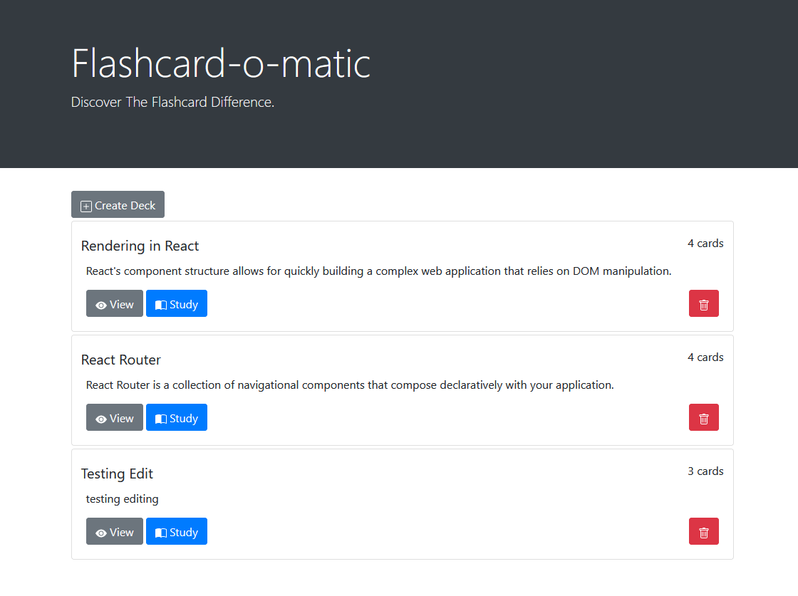
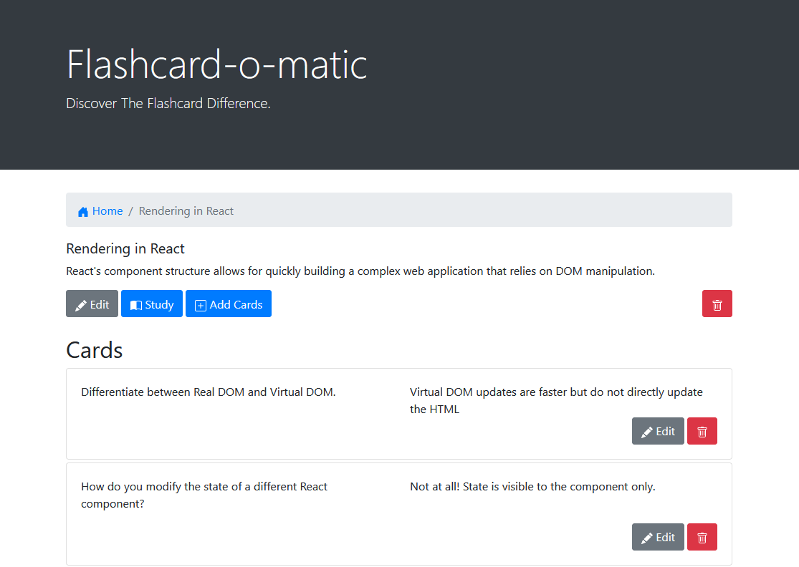
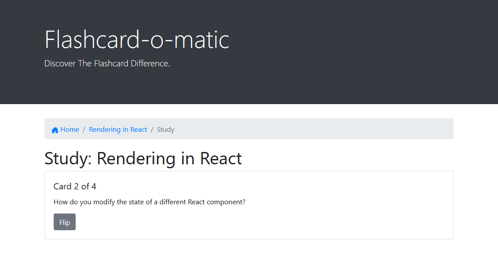
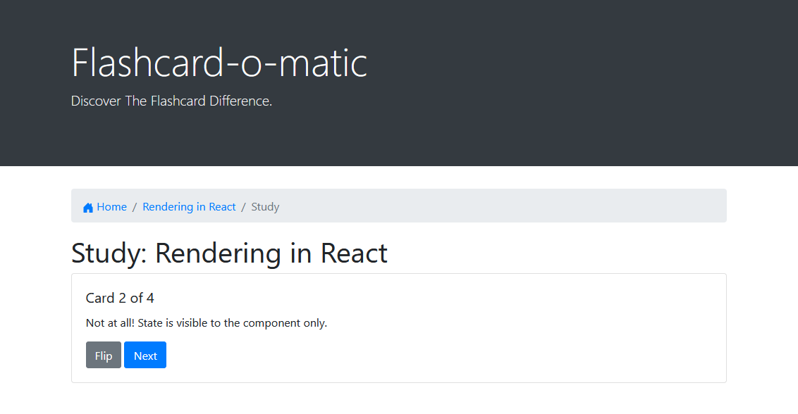
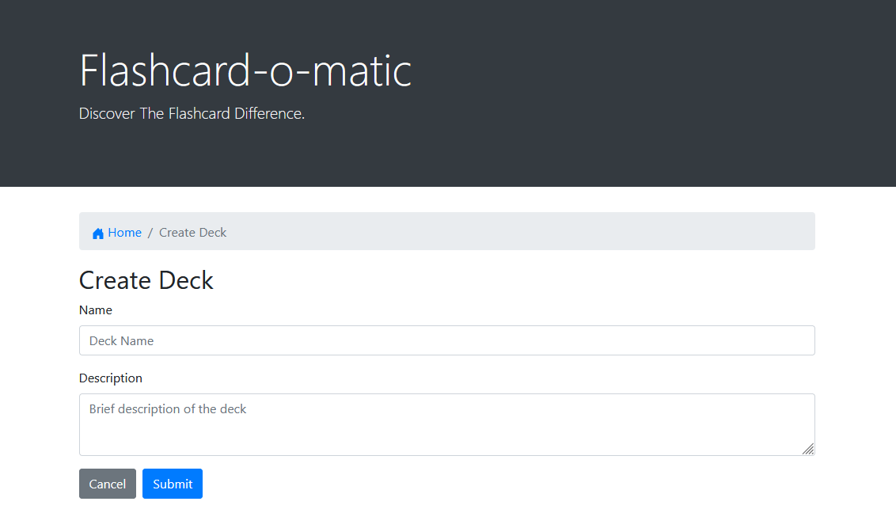

# Flashcard-o-matic
Front-End project for Thinkful.

This app allows user to create, read, update or delete decks of flashcards and cards for each deck.

Flashcards are meant as supplementary help for studying. Each contains a question and a button to flip it to the other side where the answer can be found. Once flashcard is flipped, user can move on to the next card.

## Tech:
This app is utilizing:
- React for state management and rendering
- Bootstrap for styling

## Preview:

